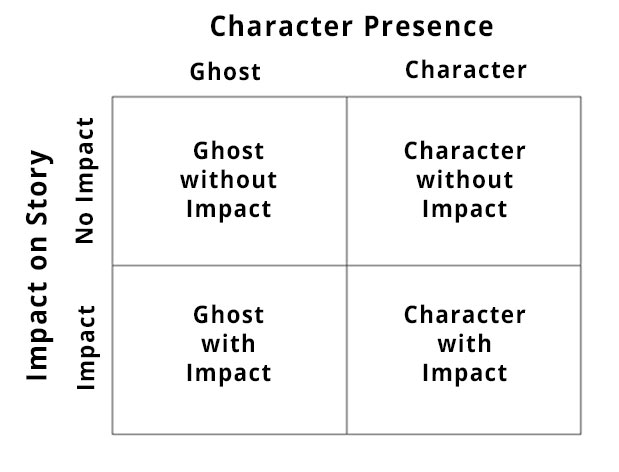
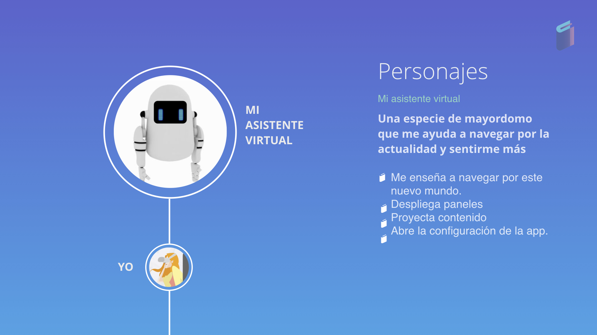
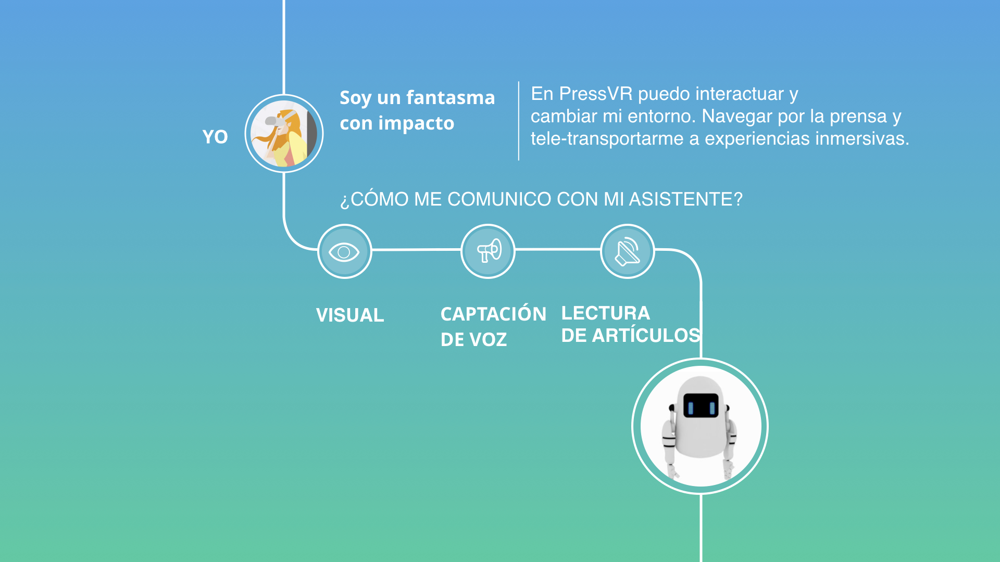

# 10.PERSONAJES

### 10.1 ¿CÓMO DESARROLLAMOS NUESTRO PERSONAJE?

 En verdad seguimos: "[GRID OF CHARACTER PRESENCE BY DEVON DOLAN Y KENT BYE](http://voicesofvr.com/292-the-four-different-types-of-stories-in-vr/)" y algunos consejos de nuestro mentor/profesor de **Guión & Narrativa:** [**Jorge Esteban Blein**](https://www.linkedin.com/in/jorge-esteban-blein-a6760a37/)**.**

### **10.2 EL PERSONAJE ELEGIDO**

**Asistente Virtual:** un **fantasma con impacto** \(significa que la narrativa no se percata de tu presencia y podemos alterar el curso de la narrativa\).

