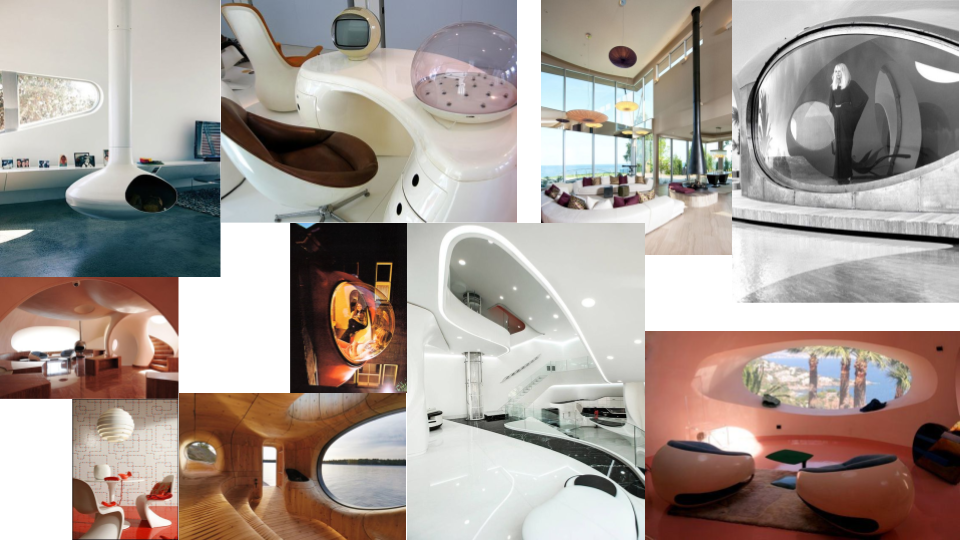

# 11.CONCEPT ART

### MOODBOARDING

El moodboard nos ha servido de inspiración para crear una aproximación de la escena principal del salón.

Este ha sido creado en [**Pinterest**](https://www.pinterest.es/mdgluk/ideas-proyecto-vr/) y nos ha ayudado a visualizar los entornos en los que se desplazará el usuario y los assets para generar los escenarios en Unity.



Mediante el el moodboarding hemos podido conceptualizar una aproximación del escenario principal y tener una variedad de assets.

