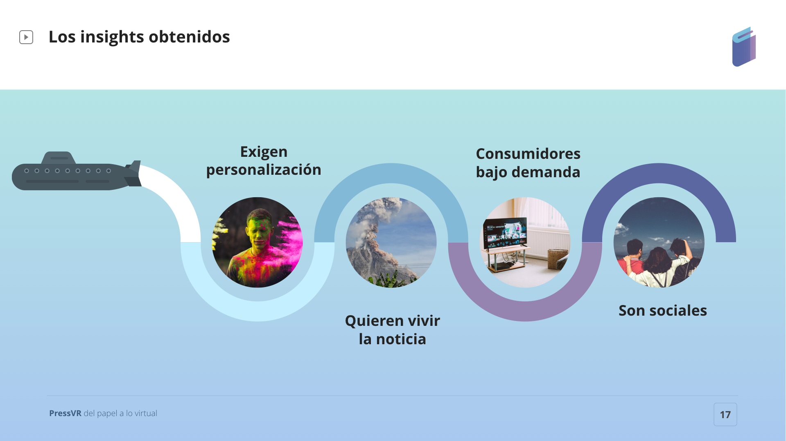

# 6.INSIGHTS

Ponemos la investigación en orden y establecemos el tipo de conclusiones que buscamos:

### 1. ¿CÓMO SON LOS USUARIOS 35-44 AÑOS RESPECTO A FORMATOS DIGITALES PARA LECTURA?

* Les gusta leer y leer prensa
* Tienen curiosidad por la tecnología y les gusta empoderarse con ella.
* Son exigentes en personalización de contenido.
* Poder “vivir” las noticias para recordarlas mejor.
* Son consumidores de contenido bajo demanda.

### 2. ¿CÓMO ES EL CONSUMO DE LECTURA DE ESTOS USUARIOS?

* Prefieren una lectura en base a recomendaciones
* Quieren informarse en base a sus gustos declarados.
* Seguir la información de sus redactores favoritos.
* Quieren poder leer una noticia más tarde.
* Son sociales y valoran poder compartir lo que se ha leído en redes sociales

### 3. ¿CÓMO DEBE SER UNA APP DE LECTURA?

#### **Contenido**

> **Últimas tendencias y actualidad**
>
> **Recomendaciones en base a gustos declarados**
>
> **Sistema de comentarios**
>
> **Fiabilidad de contenido/respaldo biográfico**

#### **Funcionalidades**

> **Ver usuarios activos**
>
> **Guardar para ver luego**
>
> **Poder compartir los vídeos o artículos**
>
> **Personalización con selección de categorías de interés**
>
> **Saber que he leído o visto**
>
> **Notificaciones de noticias relevantes**

#### **Perfil**

> **Poder ver lo que la gente lee \(tipo MEDIUM y favoritos\).**
>
> **Personalización de entorno \(música...\)**
>
> **Visualizar datos de consumo y conexiones.**

#### **Sala virtual**

> **Foro para discutir temas de interés**

Aunque teníamos dos personas, nos centraremos en los insights de nuestra **persona 1-usuarios  35-44 años,** dejando la **persona 2-periodistas, redactores y directores** más de cara a monetización de la app.

