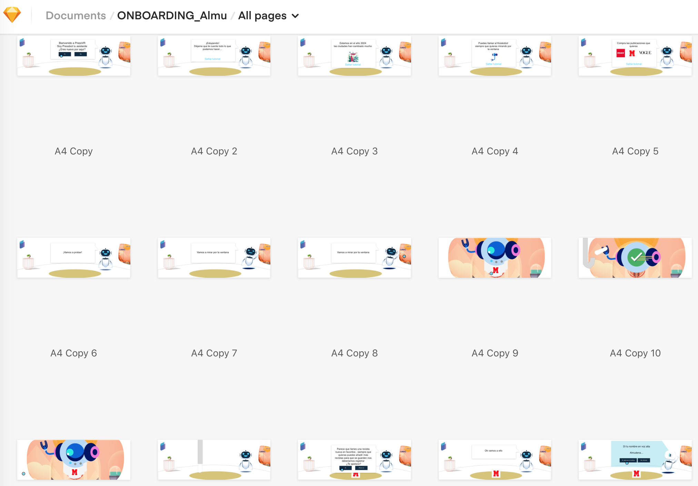

# 8. GUIÓN Y NARRATIVA

Press VR nace de la evolución del comportamiento de los consumidores de información así como de la necesidad de la empresas en la industria de la prensa de atraer y retener a usuarios.

Por tanto, nuestra narrativa y selección de escenarios está fundamentado en los formatos de demanda y la integración de experiencias que envuelvan a nuestros usuarios haciéndolo testigo de las noticias.

### ¿ CÓMO LOGRAMOS ESTA INMERSIÓN ?

El entorno retrofuturista nos ayuda a crear una inmersión distinta, a crear un recuerdo y a aportar mayor valor a la app más allá de una aplicación de lectura de prensa.

### CONTEXTO \| ESCENARIO

La gente vive en edificios altísimos donde la forma de comprar y el consumismo se ha transformado en drones o mini-naves que vuelan por las calles.

En todas las casas tienen un robot asistente.

Por la ventana se ve este entorno, pero nuestro robot puede cambiar lo que vemos a través de ellas como parte de nuestros settings..

### **UBICACIÓN DE ESCENAS: AÑO 3029**

Llegamos a casa \(retrofuturista\) después de un duro día y nos sentamos en nuestro sillón.  
Tu asistente virtual \(robot\) te ayuda en todo momento.  
Nos relajamos y comenzamos a explorar la actualidad de los periódicos, a descubrir nuevos mundos dentro de los documentales...  
Puedes tener tu propio quiosco en casa, consultar todas las publicaciones que quieras de manera inmersiva y desde tu propio sillón virtual.



### ONBOARDING \| STORYBOARD

Diseño del Onboarding y definiendo la Experiencia de Usuario \(UX\).

Este Onboarding explica: cómo nuestro asistente nos muestra la habitación y nos dice que podemos hacer en cada momento.

\[ Onboarding\_AlmudenaLópez-Click [**here**](https://sketch.cloud/s/nJGdV) **\]**

