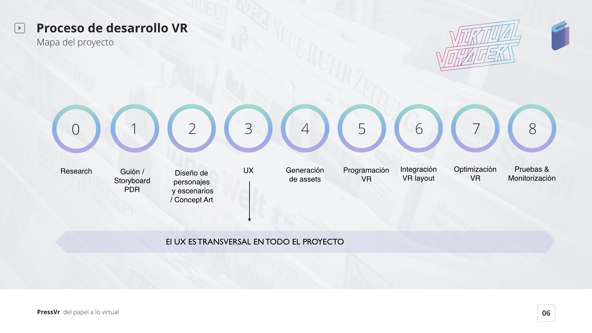

# 3.EL PROCESO

### 3.1 Mapa del Proyecto

Estas son las etapas que seguimos durante el proyecto:

### 3.2 Proceso del Desarrollo de Realidad Virtual

Trabajamos en estas fases para poder hacer la entrega del prototipo en Unity y estar lo más cerca posible de un producto final. Además el diseño UX fue aplicado a cada fase para obtener un prototipo VR que los usuarios pudieran sentir, experimentar y vivir.

### 3.3 Video del Proceso

¡ Así es como trabajamos como equipo !



