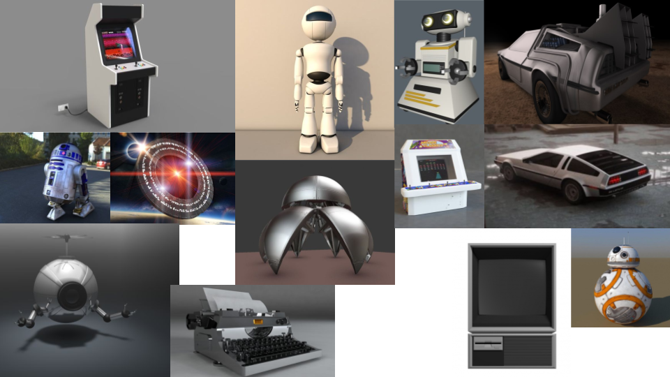
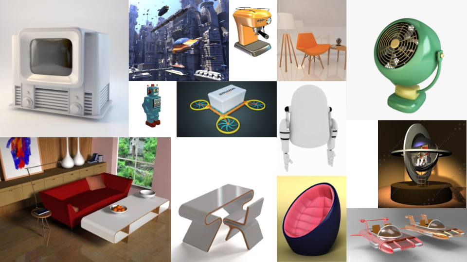
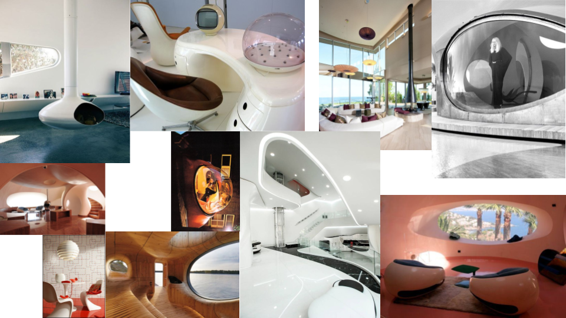
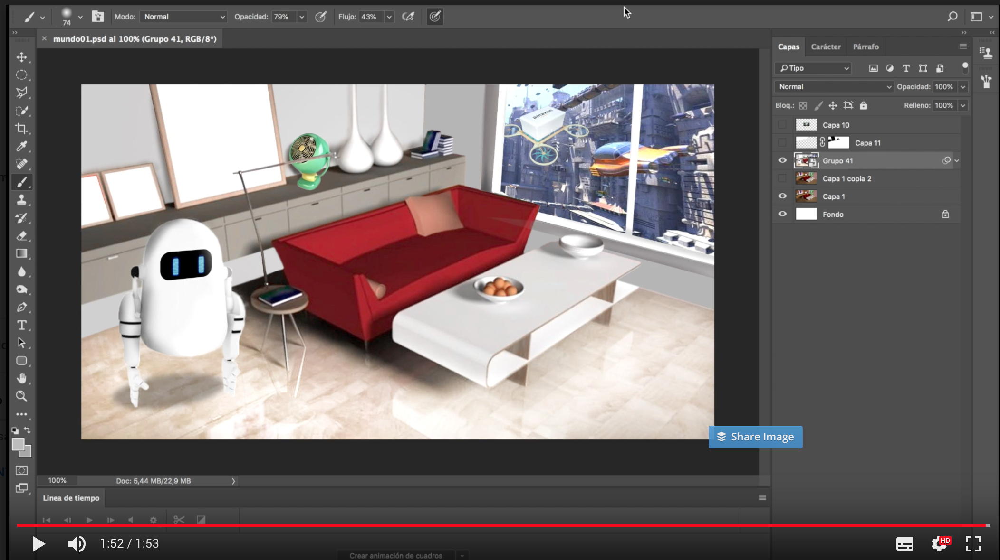
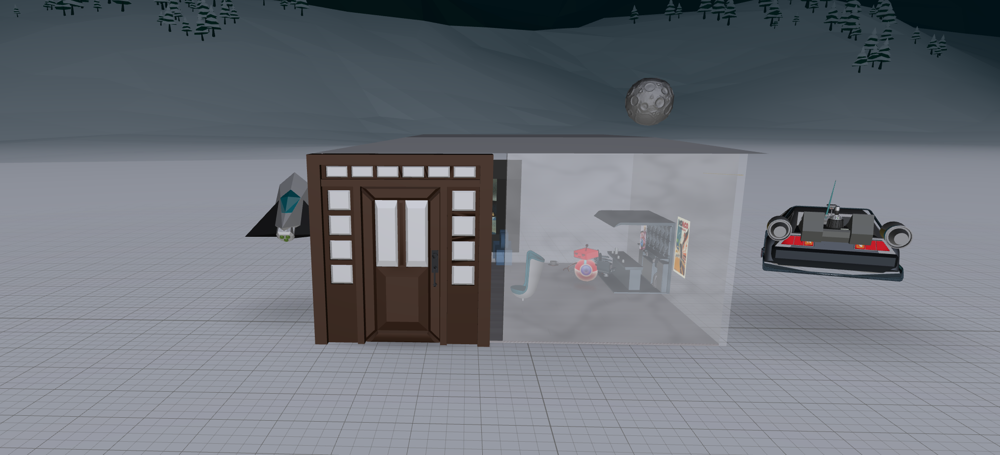
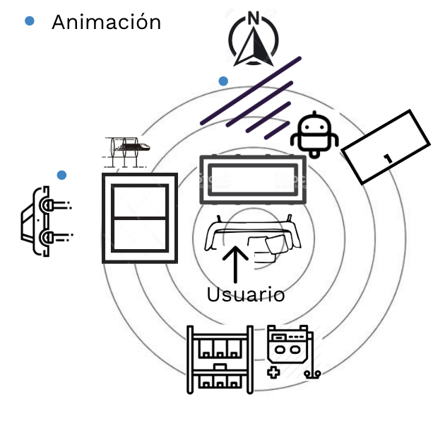
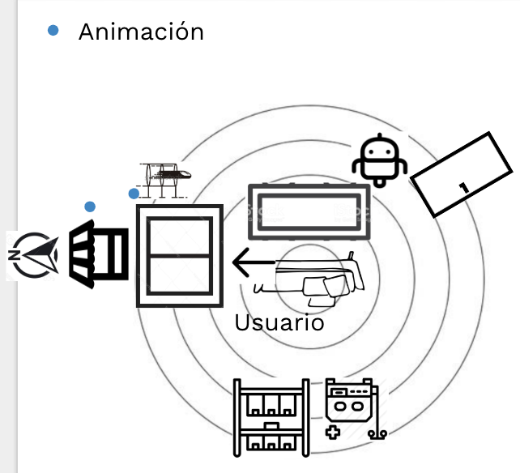
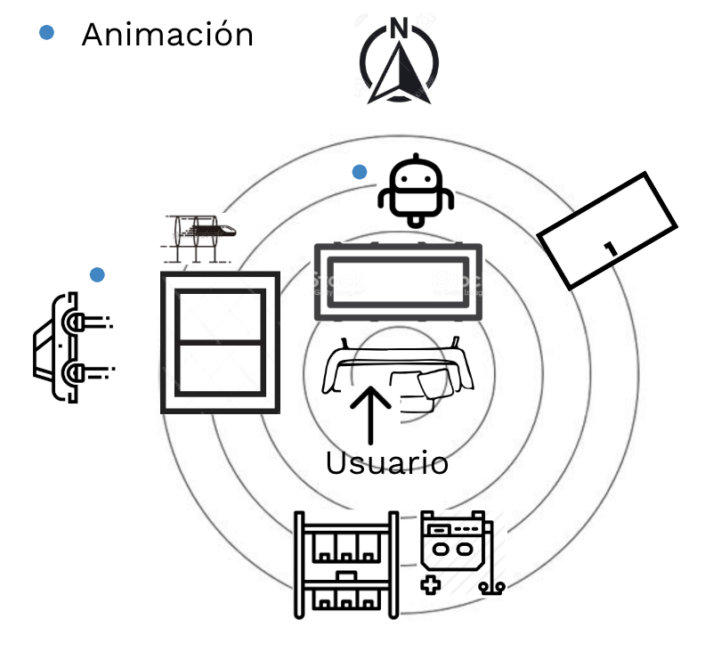
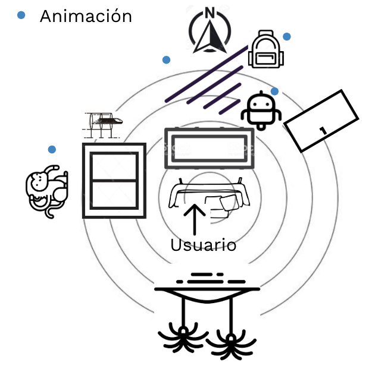
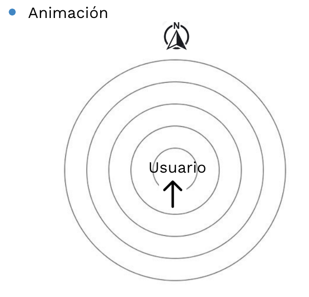

# 6. ESCENARIOS

## 

## 6.2. CONCEPT ART DE ESCENARIOS

Mediante el el moodboarding hemos podido conceptualizar una aproximación del escenario principal y tener una variedad de assets.

### PROTOTIPOS CONCEPT ART PARA ESCENARIOS

#### PROTOTIPO 1

  
**\[** [**Aquí puede visualizar el vídeo**](https://drive.google.com/file/d/12l81TcG6YeAzhm09bUmLwsPBA03KlndK/view?usp=drive_open) **de este prototipo. \]**

**PROTOTIPO 2**

  
****Este prototipo lo puede visualizar en **WebVR \| Realidad Aumentada con móvil o tablet \| Realidad Virtual**



## 6.3. DEFINICIÓN DE ENTORNOS-ESQUELETO

Una vez generado ideas y creado prototipos de aproximación, definimos  los entornos a bajo nivel.

### ESCENA 1: ONBOARDING-1er Nivel

### ESCENA 2: SELECCIÓN DE REVISTAS/PERIÓDICO CON KIOSCO-1er Nivel

### ESCENA 3: ESCENA PRINCIPAL SALÓN-1er Nivel

### ESCENA 4: PERSONALIZACIÓN DE PORTADA REVISTA

### ESCENA 5: VÍDEO 360º-3er Nivel

## 6.4. CONFIGURANDO ESCENARIOS-EL BODY

## 6.5. IDEACIÓN DE ASSETS

Usamos la herramienta Milanote para la creación de posibles assets.



