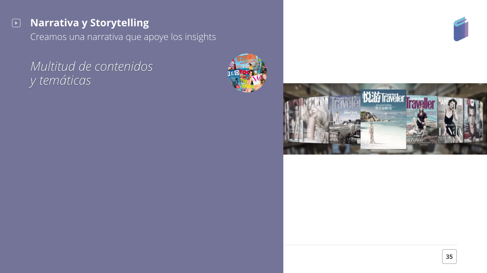
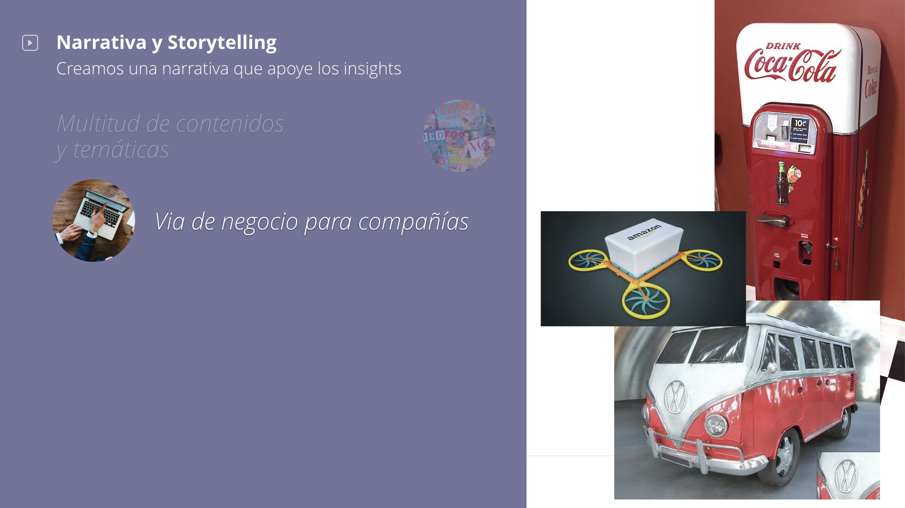
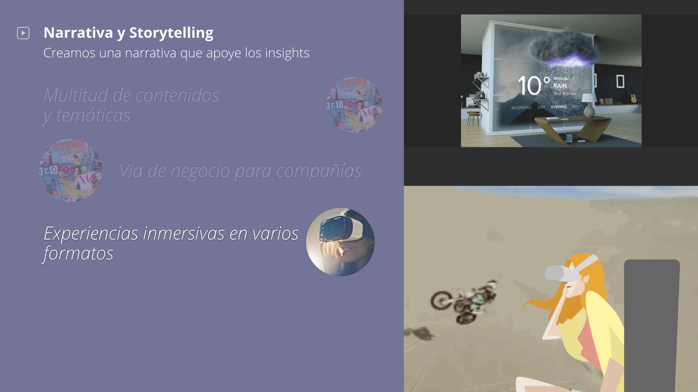
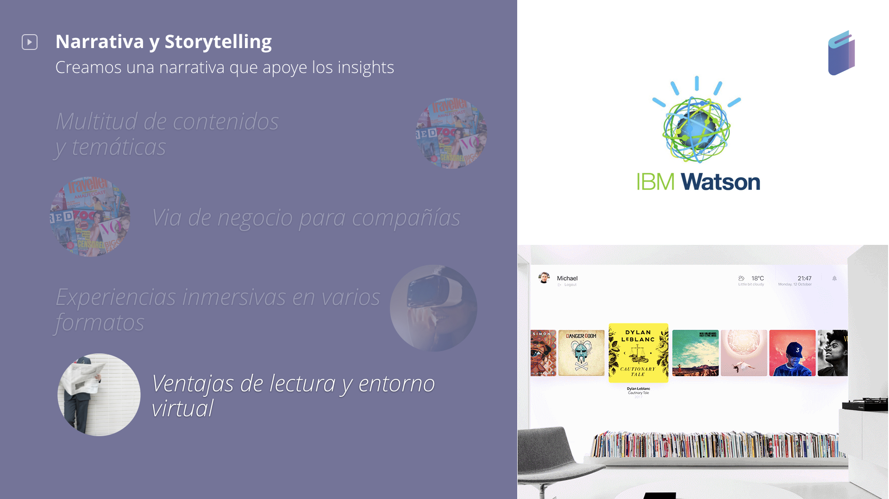

# 7. PROPUESTA DE VALOR & ESTRATEGIA

Aplicamos [La Teoría del Círculo Dorado por Simon Sinek.](https://www.youtube.com/watch?v=w4VO4Lt1fqI)

### WHAT \| QUÉ VENDEMOS

Una app/plataforma de búsqueda y selección de revistas o periódicos.

### HOW \| CÓMO LO VENDEMOS

Creando una experiencia virtual inmersiva de acuerdo a los nuevos formatos emergente en prensa.

### WHY \| CUÁL ES EL PROPÓSITO DE "PRESS VR"

Mediante esta app ayudamos a mejorar la experiencias de las noticias actuales y a retener a los usuarios. Además usamos una tecnología emergente que añade un V.A.:

* Integrar a los usuarios como testigos de noticias actuales
* Eliminamos distracciones 
* Creación de un recuerdo único de cada experiencia generada

> Queríamos que las personas pudieran disfrutar de un contenido como Netflix y las últimas tendencias.

> Una gran idea para monetizar podría ser : integrar anuncios diegéticos en la casa virtual que creamos. Por ejemplo: un Dron de Amazon volando por tu ventana, una Coca-Cola en tu mesa mientras lees tus noticias ...

> El tercer nivel que se desarrolló fue soportado a través de diferentes formatos de noticias como: videos 360º, interacciones 3D \(sentir el clima en tu sala virtual\), un objeto 3D con el que puedes interactuar \(rotación\).

Se ha demostrado que un entorno virtual puede producir en los usuarios la sensación de presencia y esto es lo que hemos creado \[ Si deseas puedes leer más sobre este estudio de doctorado: [Affective Interactions Using Virtual Reality: The Link between Presence and Emotions](https://pdfs.semanticscholar.org/500d/6e335c8490234511a74b3165fac606fc543d.pdf). \]

