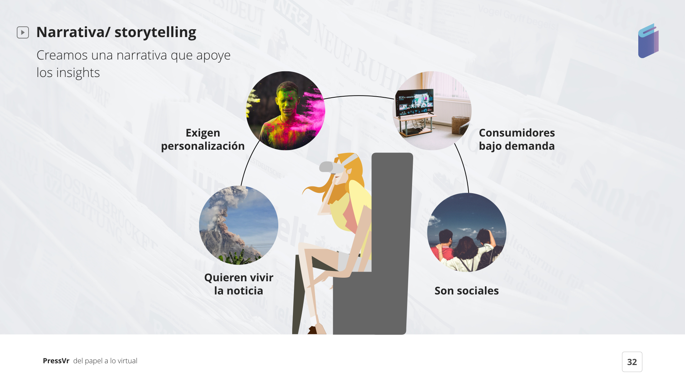

# 7. PROPUESTA DE VALOR & ESTRATEGIA

Aplicamos [La Teoría del Círculo Dorado por Simon Sinek.](https://www.youtube.com/watch?v=w4VO4Lt1fqI)

### WHAT \| QUÉ VENDEMOS

Una app/plataforma de búsqueda y selección de revistas o periódicos.

### HOW \| CÓMO LO VENDEMOS

Creando una experiencia virtual inmersiva de acuerdo a los nuevos formatos emergente en prensa.

### WHY \| CUÁL ES EL PROPÓSITO DE "PRESS VR"

Mediante esta app ayudamos a mejorar la experiencias de las noticias actuales y a retener a los usuarios. Además usamos una tecnología emergente que añade un V.A.:

* Integrar a los usuarios como testigos de noticias actuales
* Eliminamos distracciones 
* Creación de un recuerdo único de cada experiencia generada

