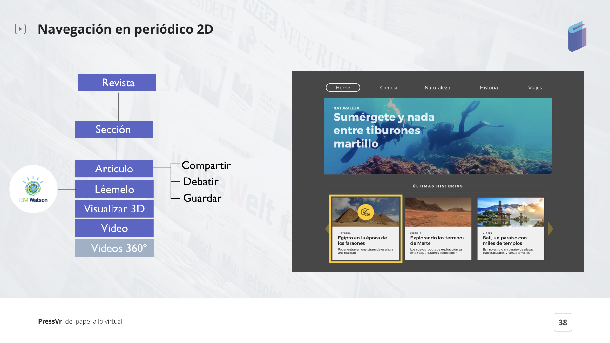
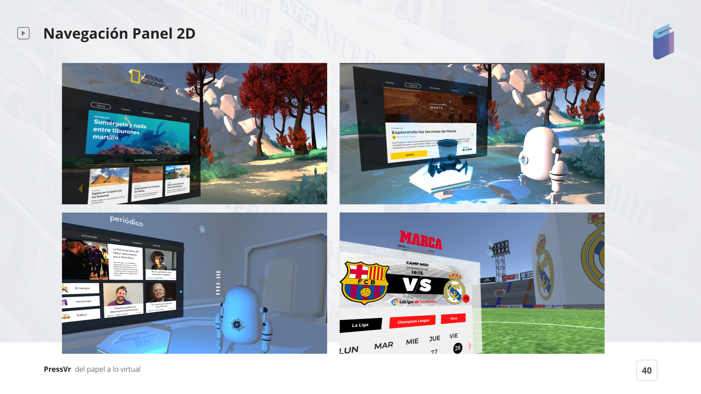
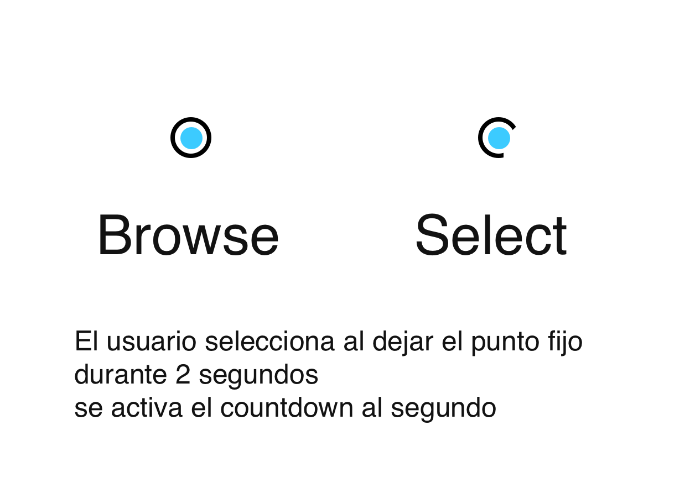
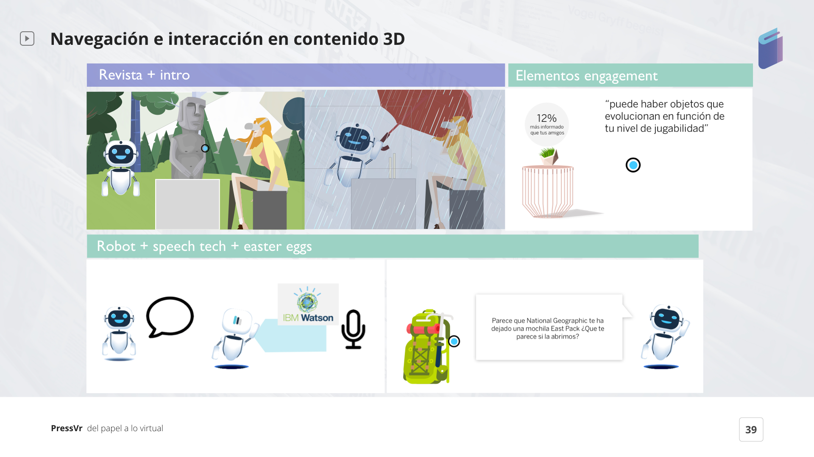

# 12. DISEÑO DE INTERACCIÓN & INTERFAZ

Dentro de la revista tenemos diferentes secciones, y en cada una de ellas tenemos diferentes formatos de contenido. Por ejemplo: tenemos artículos que podríamos compartir, discutir o guardar, la opción de lectura con Watson, podemos visualizar contenidos 3D o 2D y videos 360º.

### 12.1 Interfaz de Usuario \(UI\)

Los paneles 2D \(una UI estática\) nos permiten navegar entre los contenidos de una revista y cuando elegimos una revista, podemos profundizar en cada noticia. Cada noticia seleccionada nos muestra un contenido interactivo y envolvente.

Seguimos algunas [**Leyes de UX**](https://lawsofux.com/) ****de [**Jon Yablonski**](http://jonyablonski.com/) para construir una excelente interfaz de usuario y mejorar la experiencia del usuario.

Como se puede ver a continuación, definimos:

* Botones de control: botones activados, desactivados y botones hover.
* Tipografía Avenir: tiene una buena calidad en realidad virtual. 
* Colores UI: los colores fueron elegidos siguiendo el color de la marca.

Aplicamos la [**LEY DE JAKOB**](https://alistapart.com/article/psychology-of-design) para nuestro diseño de panel 2D porque _“By leveraging existing mental models, we can create superior user experiences in which the user can focus on their task rather than learning new models.”-_by [**Jon Yablonski**](https://alistapart.com/author/jonyablonski)\*\*\*\*

### 12.2 Interacción UI

Tratamos de hacer una interfaz de usuario útil y agradable para los usuarios.

**Cómo hicimos esto?**

Utilizamos el **puntero de mirada VR** para interactuar con el contenido seleccionado, lo que significa que **no necesitas un controlador \(mando\)** si deseas interactuar con un menú, el entorno o cualquier objeto.

\[ InteracciónUI\_AlmudenaLopez \| Clica ****[**aquí**](https://sketch.cloud/s/5P897) **\]**

Para agregar, los usuarios sabrían cuándo finalizan la selección gracias a la cuenta regresiva \(se estableció en un tiempo de 2 segundos\) y el sonido al final.



**12.3 Navegación e Interacción \| Contenido 3D**   
Algunos de estos paneles nos envían un pequeño contenido 3D frente a nosotros con el que podemos interactuar. Podemos jugar con objetos que evolucionan de acuerdo a nuestras horas de uso \([**gamificación**](https://yukaichou.com/gamification-examples/octalysis-complete-gamification-framework/)\) o incluso recibir recompensas como objetos virtuales al visitar las publicaciones de las principales marcas.

  

