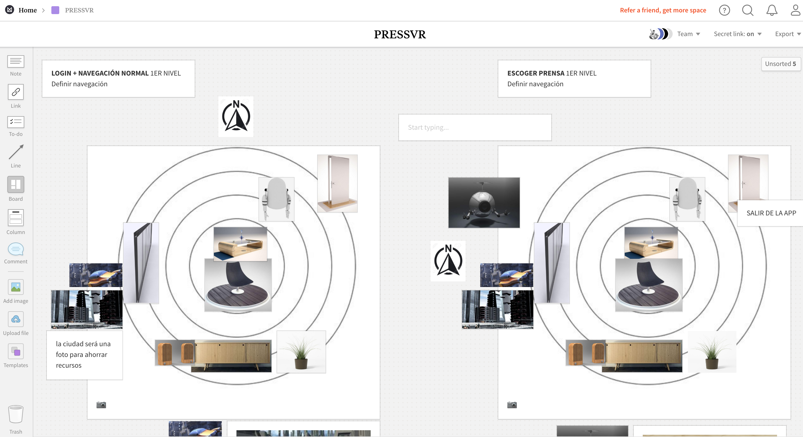

# 13. GENERACIÓN DE ASSETS

Creamos un panel colaborativo en [Milanote](https://app.milanote.com/1GqX671P18117M/pressvr) para visualizar los elementos en el espacio y buscamos referencias para empezar a componer nuestras escenas con assets adquiridos o que pudieran ayudaros a modelar.

Algunas páginas que usamos para nuestros modelos y Unity :

* [Unity Asset Store](https://assetstore.unity.com/categories/3d)
* [cgtrader](https://www.cgtrader.com/free-3d-models)
* [TURBOSQUID](https://www.turbosquid.com/Search/3D-Models)
* [Free 3D](https://free3d.com/3d-model/sci-fi-cars-and-buildings-47816.html)



