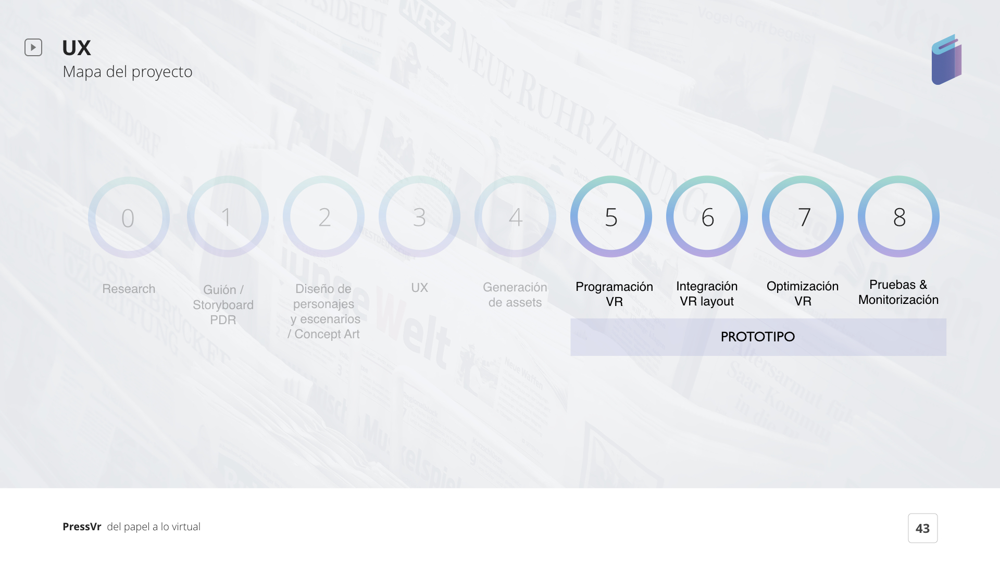

# 14. PROTOTIPO EN UNITY

Y después de la Programación VR, la integración VR layout, la Optimización VR y las Pruebas, tenemos nuestro **primer prototipo en VR** para [**OCULUS GO**](https://www.oculus.com/go/) & [**RIFT**](https://www.oculus.com/rift/).

¡Esperamos que os guste!Nuestro equipo puso toda la energía y la voluntad para hacerlo realidad :\)



Puedes disfrutar del **Demo day de nuestros proyecto Press VR** en The Cube en Madrid:



