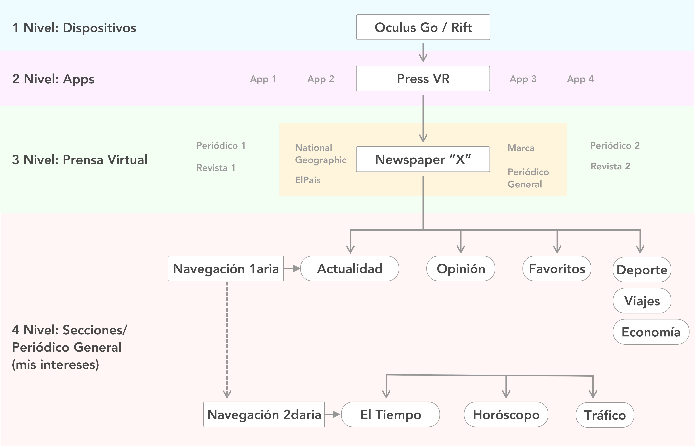
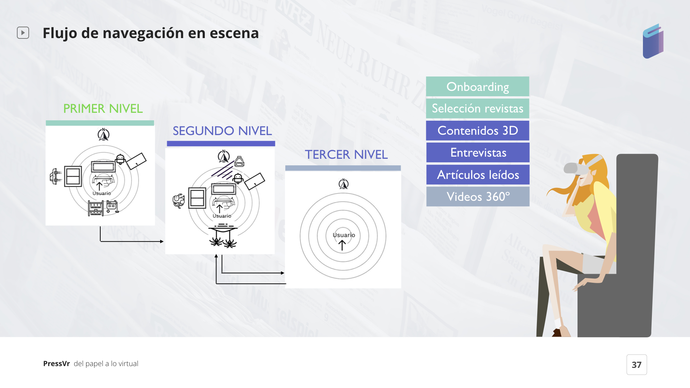
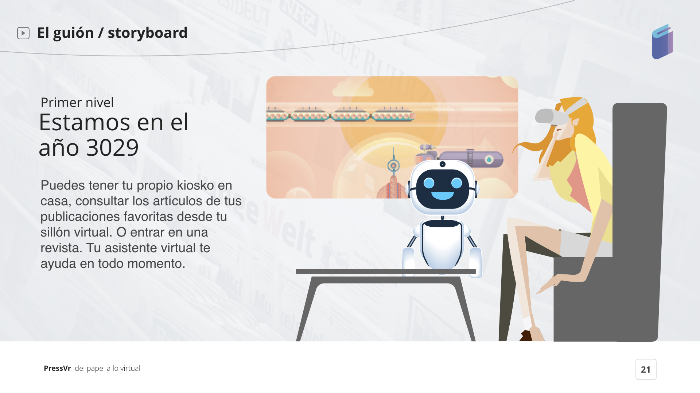
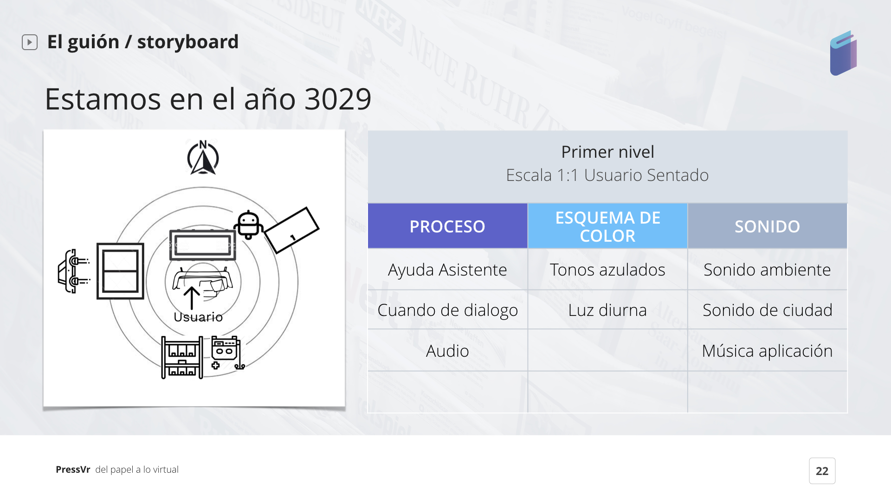
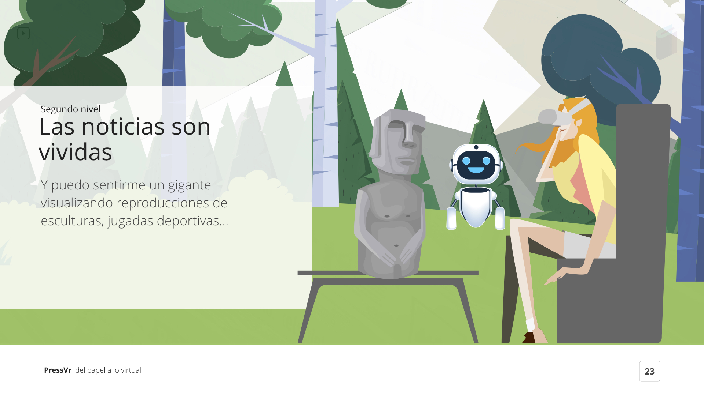
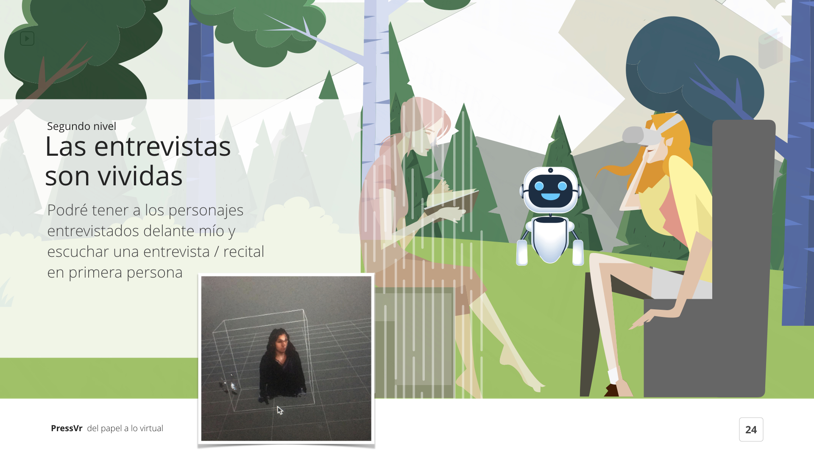
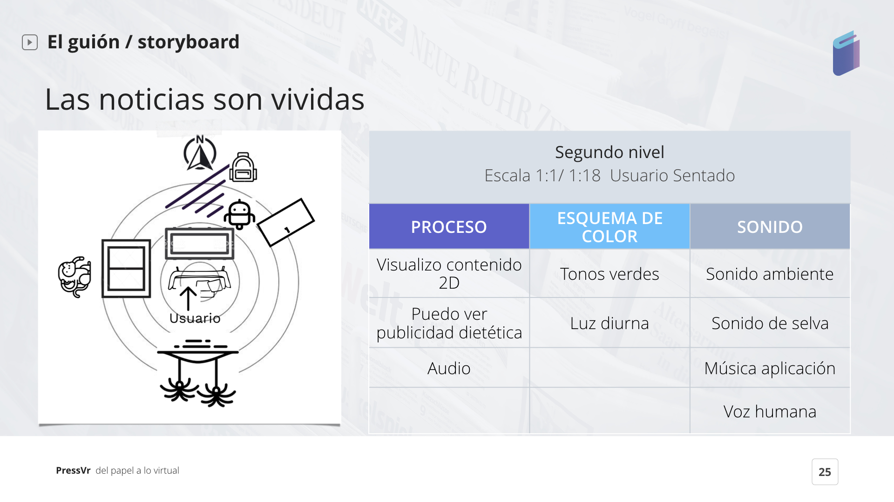
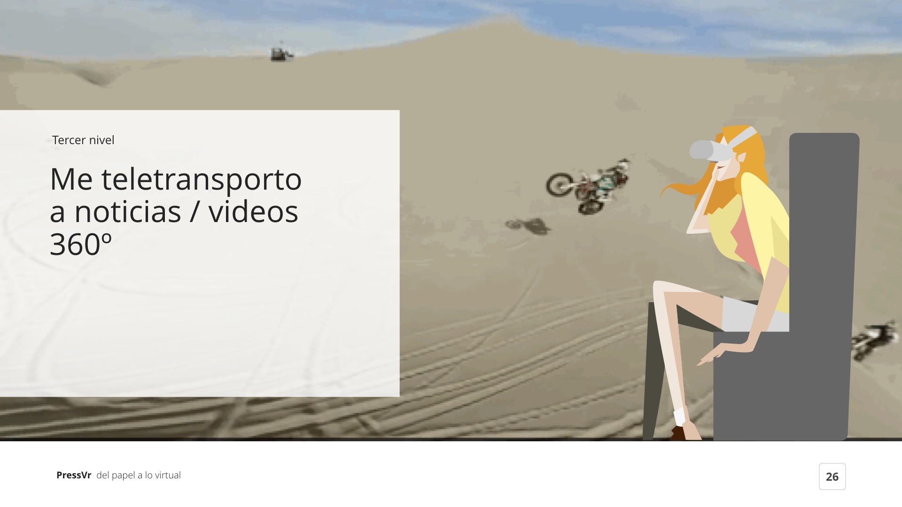
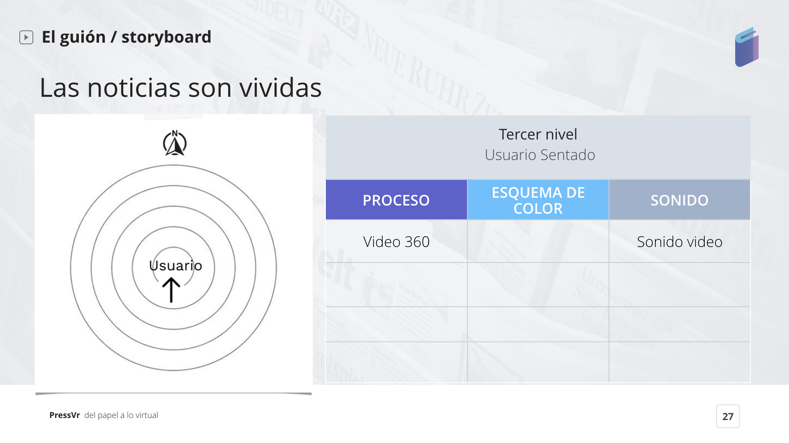

# 9.ARQUITECTURA INFORMACIÓN & FLUJOS

> **“Information Architecture is the creation of a structure for a website, app, or other products, that allows users to understand where they are — and where the information they want is — in relation to their current position.”**

> “Information Architecture uses some elements of [**cognitive psychology**](http://information%20architecture%20uses%20some%20elements%20of%20cognitive%20psychology%20to%20define%20the%20way%20information%20should%20be%20structured./) to define the way information should be structured.”-by [Adobe Blog](https://theblog.adobe.com/a-beginners-guide-to-information-architecture-for-ux-designers/)

\[ Arquitectura Información \| **Click** [**aquí**](https://my.mindnode.com/egf8dMsGoFbSsydbBp3yS8ckyYwQPGLezxg36of4) ****\]

**Flujo de Navegación \| Experiencias a través de 3 niveles:**

## **9.1 Primel nivel \| Onboarding & Selección de Revistas/Periódicos**

Tenemos a Enriqueta, en el año 3029, en su casa del futuro, donde su asistente personal le ayuda a manejar su casa y a consumir noticias.

Sentada en tu silla puedes preguntarle a tu asistente de mostrarte la prensa disponible, escoger una publicación y navegar dentro de ella.



## **9.2 Segundo nivel \| Personalización del ambiente de Revista/Periódico**

Cuando Enquireta elige una publicación, se teletransporta a un ámbito personal, como por ejemplo: ella iría al Macchu Pichu cuando entre en el National Geographic. Además, si fuera al periódico Marca.com, estaría en un Estadio.

Enriqueta puede también atender una entrevistas que ha sido creada con una captura volumétrica y después la persona se materializará en frente de ella.

### **9.3 Tercer nivel \| Noticias inmersivas**

Adicionalmente, puedes leer contenido 2D o pedirle a tu asistente que te lea las noticias, puedes ver esculturas en 3D, **hologramas**, o una representación de los próximos Juegos Olímpicos en 2020 \(Tokyo\) o incluso vídeos 360º.



