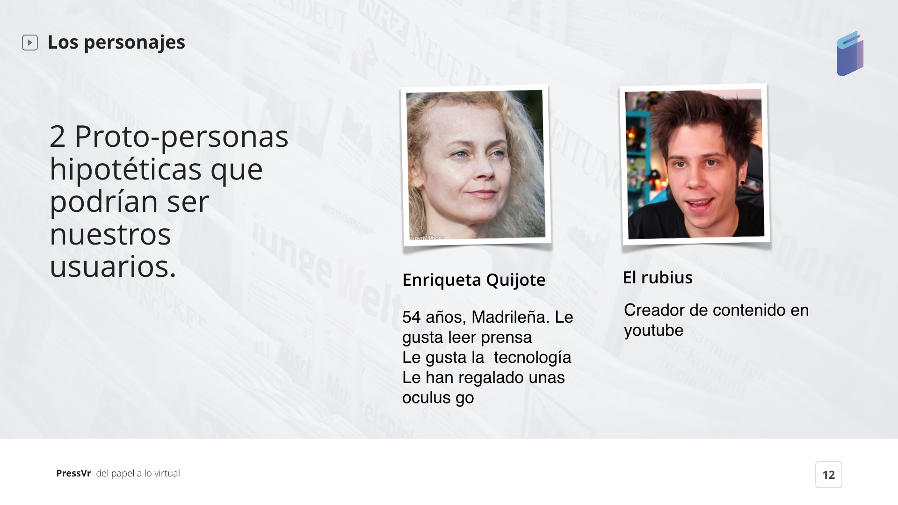
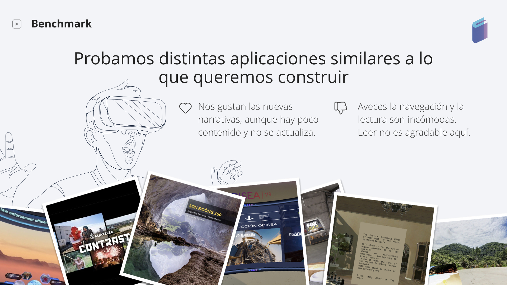

# 4. RESEARCH

## 4.1 Analizando Press VR \| El primer problema

### 4.2 Investigando para obtener Insights

## PARA ENTENDER AL USUARIO

### 1. Creando Personas \| Proto-Personas

Creamos una hipótesis de lo que podrían ser nuestros usuarios potenciales.

Establecimos **2 perfiles:**

1. **Un youtuber tipo Rubius**
2. **Un lector de 55 años**

Al principio pensamos que el creador de contenidos podría ser usuario para nuestra App, pero fue descartado tras los resultados del cuestionario.

A continuación la investigación cuantitativa nos ayudará a definir mejor nuestras Personas.

### 2. Resultados de la Encuesta

#### **CUESTIONARIO DE LA ENCUESTA**

El trabajo de campo se realizó durante 7 días consecutivos, desde el 19 al 25 de Noviembre de 2018, a través de un cuestionario en Google form.

El cuestionario constó de un máximo de 12 preguntas y una sola pregunta fue abierta.

#### PRINCIPALES CONCLUSIONES DE LA ENCUESTA

De los 135 encuestados, 88 personas son mujeres \(65,2%\) y 47 hombres \(34,8%\).

Además el 43,2% de los encuestados está comprendido entre 35-44 años, seguido de un 34,8% para las edades entre 25-34 años.

#### Experiencia de uso en gafa virtuales

* Número de encuestados es de 135, de los cuales 76 han utilizado gafas virtuales.
* De los 135 encuestado, un 10% más ha experimentado la realidad virtual \(77 personas\) frente a la realidad aumentada \(65 personas\).
* La frecuencia de uso de gafas es de al menos entre 1 a 2 veces por semana.
* Las gafas virtuales más usadas son las Samsung Gear VR en un 28,9%, seguidas de las Oculus Go y Rift en un 24%.

#### Preferencias de consumo de información

* El 50% de los que han usado gafas han consumido realidad virtual para ver vídeos y juegos.
* Los formatos de consumo de información se centran en la lectura \(83%\) y vídeos en Youtube \(63%\)

#### Formatos de lectura y grado de sociabilidad para lectores.

* De las 107 personas que suelen leer sólo un 32% está suscrito a formato digital y apenas un 7% al formato en papel.
* De las 107 personas que leen usualmente 65 personas \(30%\) tienen una app de periódicos o plataforma de lectura. Luego un 10% tiene curadores de contenido.
* Un 60% suele compartir lo que lee sin embargo sólo el 45% debatiría temas en una sala virtual.

#### Tendencias y comportamientos en redes sociales

* La red social más compartidas de lecturas es Whatsapp con un 70%, seguido de Facebook \(55%\) , Linkedin \(46%\) y Twitter \(43%\).
* Un 83,3% suele guardar los artículos que lee para leerlos después.
* El 68% se nutre de información a través de redes sociales, un 64% suele consultar lo último publicado del periódico o revistas y un 34% suele informarse a través de sus redactores favoritos.

#### Herramientas de uso del Redactor y grado de sociabilidad.

* Tuvimos 8 respuestas de personas lectoras y redactores o que escriben.
* Prácticamente el 100% escribe para formato digital frente al papel.
* El 75% de los redactores les gustaría poder debatir en una sala virtual lo que ha escrito.

#### Análisis de contenido y tipos de formatos en periódicos y revistas.

* Tuvimos 8 respuestas de personas lectoras y que trabajan en un periódico o revista.
* El tipo de contenido generado actualmente es del 100% digital.
* Secciones donde se está generando contenido VR o AR es de un 75% en tecnología, un 25% en deporte y en un 12,5% en el Tiempo, Viajes y Economía.

#### RESULTADOS DE PREGUNTA ABIERTA

**¿Qué debe tener una app de lectura donde puedas informarte de la actualidad y a la vez puedas socializar?**

**Contenido**

> **Últimas tendencias y actualidad**
>
> **Recomendaciones en base a gustos declarados**
>
> **Sistema de comentarios**
>
> **Fiabilidad de contenido/respaldo biográfico**

**Funcionalidades**

> **Ver usuarios activos**
>
> **Guardar para ver luego**
>
> **Poder compartir los vídeos o artículos**
>
> **Personalización con selección de categorías de interés**
>
> **Saber que he leído o visto**
>
> **Notificaciones de noticias relevantes**

**Perfil**

> **Poder ver lo que la gente lee \(tipo MEDIUM y favoritos\).**
>
> **Personalización de entorno \(música...\)**
>
> **Visualizar datos de consumo y conexiones.**

**Sala virtual**

> **Foro para discutir temas de interés**

### **3. Validando Personas \| Después de la Investigación de Usuarios**

Las personas o personajes se determinan una vez hecha la investigación cuantitativa y cualitativa tras profundizar en el target.

Tenemos así **dos personas modelo**:

#### PERSONA 1-Usuarios 35-44 años

Hemos validado esta persona 1 tras los datos cuantitativos y cualitativos \(pregunta abierta\) obtenidos en la encuesta.

#### PERSONA 2-Periodistas, redactores y directores

Hemos validado esta persona 2 tras el feedback del cuestionario hecho y las necesidades del mercado que hemos identificado a continuación \(benchmark, mapa de tendencias\).

## PARA ENTENDER EL NEGOCIO

### 1. DIAGNÓSTICO DE LA INDUSTRIA

Analizamos la situación de la industria periodística.

#### **1.1 DESAFÍOS DE LA INMERSIÓN DEL PERIODISMO**

**Insights del artículo:**

* Hacer al usuario que pase de ser pasivo a ser activo.
* Al hacer la navegación libre, la narrativa debe encajar, pero un cierto grado de incoherencia es admisible si se ha logrado la inmersión.
* Anticiparse al usuario y elegir los puntos de puntos de interés según su punto de vista es también un desafío. Cómo construir una narrativa sin que demasiados estímulos o puntos de interés hagan que pierdas la sensación de inmersión.
* Decidir si queremos que los usuarios sean visitantes \(voyeur\) dentro de una historia. Convertir a la audiencia en participantes.
* Tratar a la audiencia como viajeros, es decir el viajero deberá regresar porque ha cambiado por la experiencia vivida. Hacer que haya un impacto emocional.
* Tratar el sonido como parte de la experiencia inmersiva y la trama de lo que queremos contar, no es sólo un audio periodístico.
* Valorar si la experiencia en vr inmersiva es el mejor vehículo para lograr que las personas se preocupen por lo que sucede en el mundo.

**\[ Puedes leer el artículo** [**aquí**](https://www.frontiersin.org/articles/10.3389/fdigh.2017.00010/full)**. \]**

#### **1.2 REALIDAD VIRTUAL Y PERIODISMO**

**Insights del paper, tiene 4 partes hechas por varios profesionales del mundo del digital journalism :**

Hay 2 posibles planteamientos: inmersión y la presencia \(la percepción de estar allí\). 

**En primer lugar :** hay mayores niveles de inmersión conducen a mayores niveles de presencia. Las audiencias se convierten en testigos.

**En segundo lugar** hacen un documental en África occidental para el medio, grabado por Frontline, Secret location y el top center for digital journalism.

**En tercer lugar** extraen conclusiones y valoran los desafíos que surgen en esta nueva tecnología que se pueden resumir en:

1. La realidad virtual representa una nueva forma narrativa, para la cual las normas técnicas y estilísticas están en su infancia .
2. El medio de realidad virtual desafía las preguntas periodísticas centrales que surgen del debate de la cuarta pared, como "¿quién es el periodista?" Y "¿qué representa el periodista?"
3. Una combinación de los límites de la tecnología, la estructura narrativa y la intención periodística determinan el grado de agencia otorgado a los usuarios en una experiencia de realidad virtual.
4. Los requisitos tecnológicos para producir periodismo de realidad virtual en movimiento son onerosos, no sinérgicos, de rápida evolución y caros.
5. En casi todas las etapas del proceso, el periodismo de realidad virtual presenta concesiones que se asientan en un espectro de tiempo, costo y calidad.
6. Los procesos y herramientas de producción son en su mayoría inmaduros, aún no están bien integrados o son comunes; todo el proceso, desde la captura hasta la visualización, requiere una amplia gama de habilidades especializadas y profesionales.
7. En este punto del desarrollo del medio, producir una pieza de realidad virtual requiere una fusión completa entre los procesos editoriales y de producción.
8. Agregar interactividad y navegación del usuario en un entorno de realidad virtual en vivo es muy útil para la producción periodística y también muy engorroso.
9. La realidad virtual de alto nivel con movimiento en vivo con interactividad adicional y elementos CGI es muy costosa y tiene un ciclo de producción muy largo.
10. La forma de este proyecto no es la única posible para la realidad virtual periodística. Otros, incluida la cobertura inmediata, pueden ser accesibles, más baratos y tener valor periodístico.

**\[ Puedes leer el Paper completo** [**aquí**](https://towcenter.gitbooks.io/virtual-reality-journalism/content/)**. \]**

### 2. BENCHMARK

Analizamos 5 aplicaciones en vr de noticias y lectura.



Una vez mapeada la competencia con sus pros y contras, seguimos con la elección de la plataforma para diseñar las experiencias en VR.

### 3. ¿ POR QUÉ HEMOS ELEGIDO LAS OCULUS GO ?

Tras la encuesta hecha, estas son las segundas gafas más usadas. Además como nuestra experiencia trata de leer y ver vídeos necesitaremos una resolución más alta de la que proporciona las Samsung Gear VR. 

Las Oculus GO nos permitirán tener una mayor inmersión y de no depender de dispositivos móviles específicos o de PC de alta gama.

Hacemos un análisis del soporte  con el que diseñaremos las experiencias VR:

### 4. MAPA DE TENDENCIAS

Esta herramienta nos permite ver las nuevas líneas de negocio y formatos que se están desarrollando en el periodismo, para así saber las previsión de las tecnologías y sector.

Según **Tristan Ferne** la industria de noticias ha reconocido un problema de atraer y retener audiencia.

> "Developing and popularising useful and attractive new formats could make news stories more recognisable when aggregated and consumed on other platforms, and provide more compelling reasons for people to visit the source sites and apps."

#### **NUEVOS FORMATOS DE HISTORIAS DIGITALES**

1. **Video corto y vertical:** a menudo con subtítulos, iniciada por AJ + y NowThis
2. **Historias horizontales:** Tarjetas deslizables como Snapchat Stories y sus clones
3. **Scrollytelling de forma larga**: evolucionó desde el original NY Times Snowfall
4. **Noticias estructuradas:** como el Circa original o las tarjetas reutilizables en Vox.com “noticias átomo”
5. **Blogs en vivo:** frecuentemente usado para grandes eventos
6. **Listicles:** como Buzzfeed
7. **Boletines y sesiones informativas:** que parecen estar en tendencia en este momento
8. **Bots y chat:** desde la aplicación Qz con estilo de chat a los muchos intentos de entregar noticias dentro de las aplicaciones de chat
9. **Líneas de tiempo:** que esperaba que fuera más común
10. **Personalizada:** que normalmente se utiliza para filtrar la elección de historias, en lugar de la historia en sí.
11. **Visualización de datos:** de gráficos a interactivos
12. **VR y AR**

**\[ Puedes leer el artículo** [**aquí**](https://medium.com/bbc-news-labs/beyond-800-words-new-digital-story-formats-for-news-ab9b2a2d0e0d)**. \]**

  
  
****

  

###  

