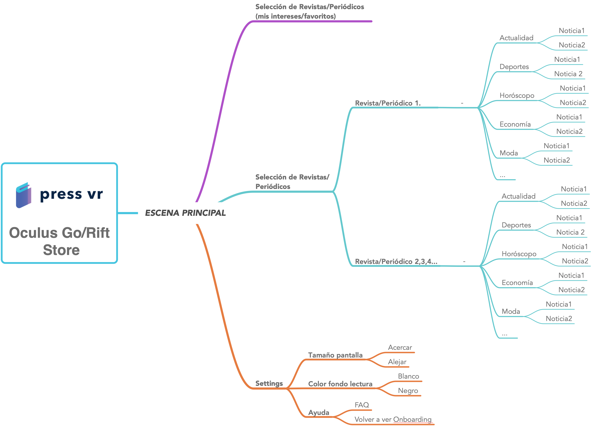
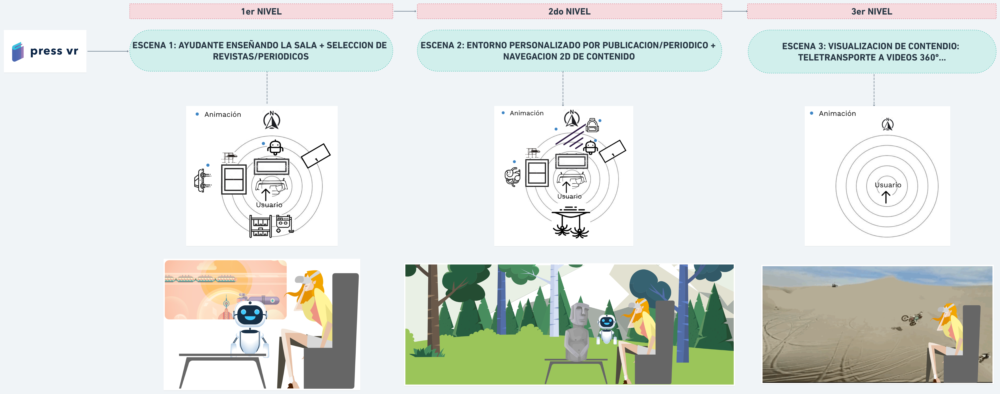

# 1.HERRAMIENTAS UTILIZADAS

### **1.1Herramienta de Gestión de Proyectos y Archivos**

* **Trello**: aquí organizamos nuestro proyecto por : TO DO, DOING y DONE tareas. Y teníamos otras columnas para aprender, inspirarnos y dejarnos construir el provecto VR.

* **Google Drive**:  trabajamos con documentos online que nos ayudó a trabajar en equipo y de forma más productiva \(rápida\).

* [**Gitbook**](https://pressvr.gitbook.io/virtual-reality-design-immersive-ux/): esta herramienta se usó para escribir una documentación de alta calidad, para mantener la investigación en orden y para compartir conocimiento.

* [**GoAbstract**](https://www.goabstract.com/): usamos esta herramienta para manejar las versiones y para colaborar con nuestros archivos de Sketch.

### **1.2 Comunicación del equipo**

* [**Appear.in**](https://appear.in/): utilizamos esta conversación de video casi cada semana para distribuir el trabajo, discutir documentos online, idear y seguir progresando en el proyecto.
* **Whatsapp**: lo utilizamos al final, para obtener respuestas rápidos y establecer una cercanía.w
* [**Slack**](https://slack.com/intl/es-es/): lo utilizamos como Appear.in, Google Drive and Trello. teníamos que comunicarnos de alguna manera porque no podíamos quedar en persona \(sólo una vez tuvimos ocasión\).
* [**vTime**](https://vtime.net/): quisimos experimentar el **VR Social** y sentti más proximidad que usando Appear.in. ¡Experimentamos diferentes ambientes y fue espectacular!

### **1.3 Herramienta de Brainstorming & Ideación**

* [**Milanote**](https://app.milanote.com/1GqX671P18117M): la usamos para inspirarnos y construir nuestros assets en Unity.

* [**Pinterest**](https://www.pinterest.es/mdgluk/ideas-proyecto-vr/): fue creado para ser un moodboarding y ser referencia de inspiración para el proyecto en Unity.

### **1.4 Herramientas de Flujos & Mapa del sitio**

* [**Mindnode**](https://mindnode.com/): lo usamos para la Arquitectura de Información \(AI\) de la App Press VR.

* [**Whimsical**](https://whimsical.co/7YEqhBLCwmfipvifheRpma): esta fue otra herramienta para la Arquitectura de Información \(AI\) de la App Press VR.

* [**Sketch cloud**](https://sketch.cloud/s/DdGO2): lo usamos para construir el storytelling,  establecer las interacciones, crear onboarding y presentar algunas ideas.

### **1.5 Herramientas UI Design** 

* [**Sketch**](https://www.sketchapp.com/): la usamos para diseñar la interfaz del usuario de la app \(paneles 2D\).

* [**Illustrator**](https://www.adobe.com/es/products/illustrator.html?gclid=Cj0KCQiAj4biBRC-ARIsAA4WaFhKKWM9ODeH3fRm6lbVgAO-a0btP7aQuOfMcObrSLACORHE-yO2akAaAk2REALw_wcB&sdid=8DN85NTQ&mv=search&ef_id=Cj0KCQiAj4biBRC-ARIsAA4WaFhKKWM9ODeH3fRm6lbVgAO-a0btP7aQuOfMcObrSLACORHE-yO2akAaAk2REALw_wcB:G:s&s_kwcid=AL!3085!3!282927371232!e!!g!!illustrator): lo usamos para crear nuestro primer storytelling del proyecto, Press VR, para construir algunos escenarios, logo…



* **Photoshop**: lo usamos para crear un Concept Art, storytelling y el contexto del primer escenario.



### **1.6 Herramientas de Prototipado**

* [**CoSpaces Edu**](https://cospaces.io/edu/): esta es una herramienta genial para crera prototipos antes de entrar en Unity- Fue una buena herramienta para sentir la experiencia en VR y AR.



* [**Unity**](https://unity3d.com/es): prototipamos diferentes escenarios para el proyecto Press VR : Selección de prensa para periódico general \( El Tiempo, Favoritos, Actualidad…\) , Selección de Prensa para Ciencia, Ocio y Viajes \(National Geographic\) y Selección de Prensa para Deporte \(Marca.com\).

* [**Cinema 4D**](https://www.maxon.net/es/productos/cinema-4d/cinema-4d/): fue usamos para modelar un mapa en 3D.

* [**Vuforia**](https://www.vuforia.com/): lo usamos para crear un **prototipo en Realidad Aumentada** **\(AR\)**.

### **1.7 Herramientas de Testing**

* [**Google Form**](https://docs.google.com/forms/d/1dJ5MyU9ugz_B5W7sK062PhrBVtn-D3brBT9jgHRBFiQ/prefill): lo usamos para hacer un cuestionario a usuarios obteniendo así 135 respuestas.

### **1.8 Herramienta de Video & Sonido**

* [**Quicktime**](https://support.apple.com/kb/DL837?locale=es_ES): fue usado para grabar lo que hicimos en nuestro portátil \(laptop\) y mostrar nuestro flujos de trabajo.
* [**Vimeo**](https://vimeo.com/user73687920): fue usado para mostrar nuestros prototipos.
* [**Bendsound**](https://www.bensound.com/royalty-free-music/electronica)**:** lo usamos para poner música libre de derechos de autor en nuestros videos.

