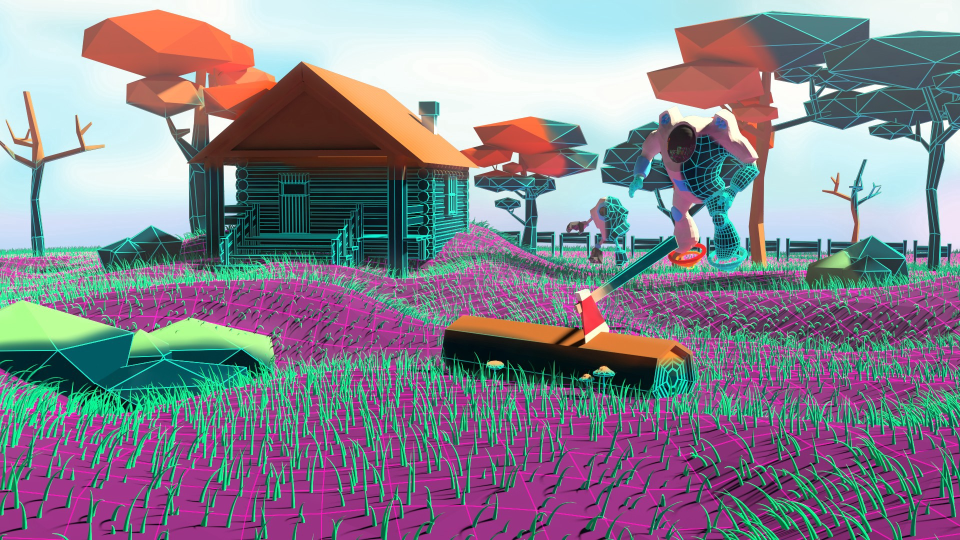

# MONETIZACIÓN EN VR

## **RESEARCH EN MONETIZACIÓN**

**Decentreland:**

* Plataforma en primer estadio de desarrollo en la que se puede comprar y vender parcelas.
* Cuando esté más desarrollado podrá servir para monetizar de otras maneras: cobrar por asistir a conciertos, salas de arte etc. 

**Vivehub:**

* Plataforma que monetiza con la posibilidad de comprar y vender experiencias. Se cobra con el uso del token VIBE.
* Mediante el uso de video volumétrico y de holograma se trata de una aplicación que acerca artistas, educadores y figuras públicas de manera diferente a su audiencia.  **Capassidad:** Creación de objetos 3d que permitirá integrarse en sitios web. Facilitará la experiencia de compras immersivas.
* Lo está empezando a usar shopify.
* Los usuarios que crean contenido 3D podrán venderlo o alquilar contenido VR/AR en esta plataforma.

**Blockv**

* Creación de objetos virtuales únicos, verificables y comerciables que pueden convivir en distintos entornos**.**
* Por ejemplo crear una clave digital que se puede canjear por un objeto en el mundo real.
* Estos objetos llamados vAtoms, combinarán código con elementos multimedia que harán que la criptomoneda sea más lúdica.

**\[ Puedes leer el artículo** [**aquí**](https://medium.com/trivial-co/blockchain-and-ar-vr-a-match-made-in-virtual-heaven-26e54782be56)**. \]**  

## **CONTENIDO FREEMIUM**

puedo acceder a todas las revistas/periódicos pero no a todo el contenido dentro de ellos.

* Suscripción a la revista/periódico completo
* Si quiero desbloquerlo, pago el mes.
* Anuncios diegéticos integrados en mi home. Ej. Dron amazon, Coca cola..\(cuidado que no sea demasiado inmersivo y chungo, limitación\).

