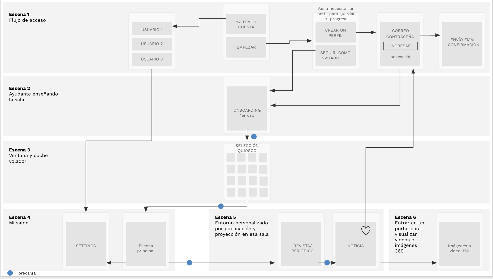
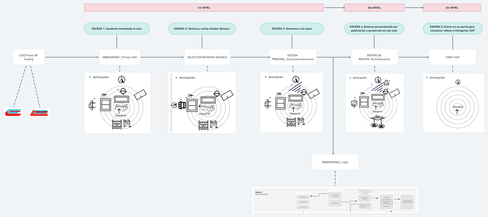

# 5. GUIÓN Y NARRATIVA

Press VR nace de la evolución del comportamiento de los consumidores de información así como de la necesidad de la empresas en la industria de la prensa de atraer y retener a usuarios.

Por tanto, nuestra narrativa y selección de escenarios está fundamentado en los formatos de demanda y la integración de experiencias que envuelvan a nuestros usuarios haciéndolo testigo de las noticias.

#### ¿ CÓMO LOGRAMOS ESTA INMERSIÓN ?

El entorno retrofuturista nos ayuda a crear una inmersión distinta, a crear un recuerdo y a aportar mayor valor a la app más allá de una aplicación de lectura de prensa.

## **5.1**. DESCRIPCIÓN GENERAL DE LA NARRATIVA

### CONTEXTO DEL ESCENARIO

La gente vive en edificios altísimos donde la forma de comprar y el consumismo se ha transformado en drones o mini-naves que vuelan por las calles.

En todas las casas tienen un robot asistente.

Por la ventana se ve este entorno, pero nuestro robot puede cambiar lo que vemos a través de ellas como parte de nuestros settings..

### **UBICACIÓN DE ESCENAS: AÑO 3029**

Llegamos a casa \(retrofuturista\) después de un duro día y nos sentamos en nuestro sillón.  
Tu asistente virtual \(robot\) te ayuda en todo momento.  
Nos relajamos y comenzamos a explorar la actualidad de los periódicos, a descubrir nuevos mundos dentro de los documentales...  
Puedes tener tu propio quiosco en casa, consultar todas las publicaciones que quieras de manera inmersiva y desde tu propio sillón virtual.



## 5.2. FLUJO DE ESCENAS

### FLUJO DE ESCENAS-ELECCIÓN



## 5.3. DESCRIPCIÓN DE ESCENAS

### INTEGRAR STORYTELLING



## 5.4. EXPERIENCIAS POR NIVELES

### 1ER NIVEL

#### ESCENA 1-ONBOARDING 1ER USO

Es la primera escena que se visualiza cuando se carga la app y la presentación de lo que se puede hacer por un ayudante robot.

#### EXPERIENCIAS

Las experiencias están en función de la escena en la que se encuentre el usuario.

1. **Presentación del salón y onboarding**
2. **La selección de revistas o periódico mediante un kiosco futurista:** desplazamos al usuario a la ventana mediante teletransporte.
3. **Escena principal de visualización de lecturas**

### **2DO NIVEL**

**ESCENA-Entorno personalizado de revista**

* Cuando seleccionas una revista, entras directamente en un entorno personalizado con su branding.
* Allí pueden personalizar sus “portadas” con grandes imágenes o vídeos.
* Cuando un contenido es 360 aparecerá delante de ti un portal para la inmersión 

1. **Selección de contenido dentro de entorno personalizado**

### **3ER NIVEL**

