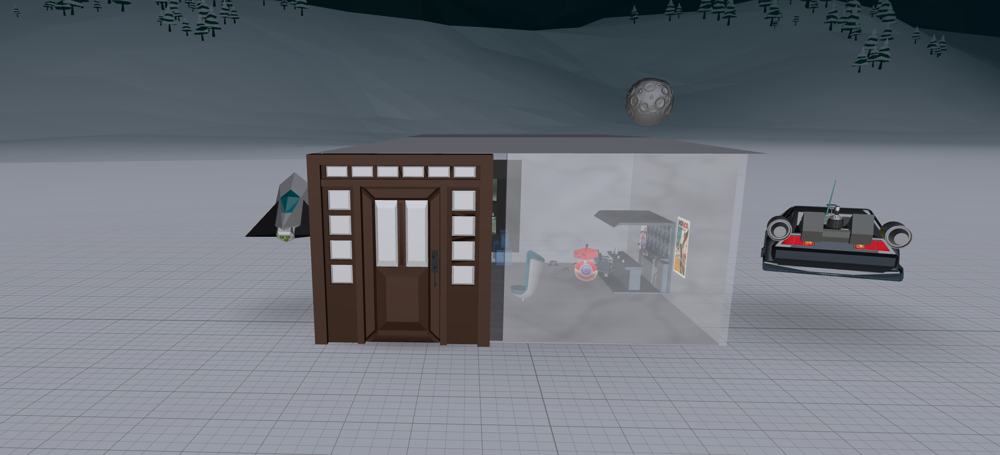

# 16.WEB VR

> “WebVR is an open specification that makes it possible to experience VR in your browser. The goal is to make it easier for everyone to get into VR experiences, no matter what device you have.”-by [webvr.info](https://webvr.info/)

### 16.1 Ideas para WebVR



### 16.2 WebVR \| Prototipo en CoSpaces Edu

  
****Este prototipo lo puede visualizar en:

* **WebVR:** explorar en espacio en 360 grados. 
* **Realidad Aumentada con móvil o tablet:** 

1. Si tienes **Android** necesitarás descargarte el soporte [**ARCore de Google** ](https://developers.google.com/ar/)que te permitirá disfrutar de la experiencia de realidad aumentada creada. 
2. Y si tienes **iOS** necesitarás [**ARKit de Apple**.](https://developer.apple.com/arkit/)
3. Además de la app CoSpaces

* **Realidad Virtual:** también si tienes las gafas virtuales Samsung Gear o Oculus Go, podrás disfrutar de esta experiencia virtualmente.



### 16.3 Oculus \| Progressive Enhancement

En realidad, Oculus ha estado trabajando en **Progressive Enhancement.**

**La aplicación de escritorio Oculus** es una app personalizada que te permite administrar tu experiencia de realidad virtual lejos de tu PC. Además, la app móvil te ayuda a: descubrir eventos, conectarte con amigos, navegar por la tienda e instalar juegos de realidad virtual en tu PC antes de llegar a casa. Puedes ver aquí [**Oculus Connect 5 \| Fundamental.**](https://www.youtube.com/watch?v=o7OpS7pZ5ok&feature=youtu.be)\*\*\*\*

  

